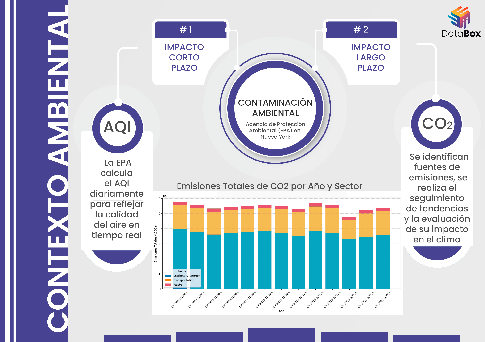
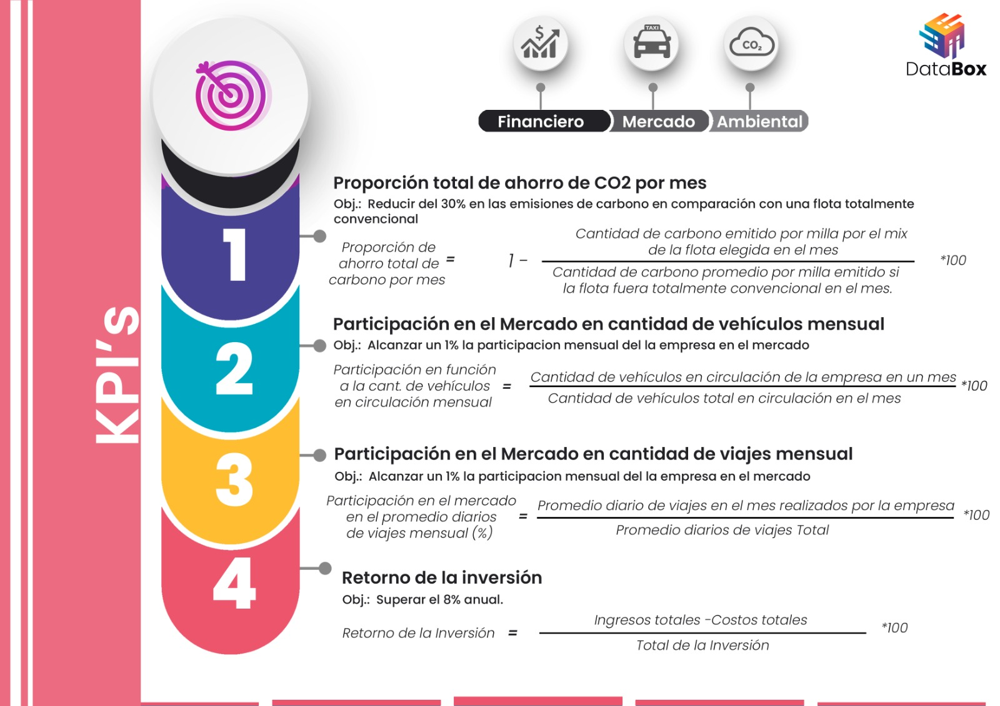
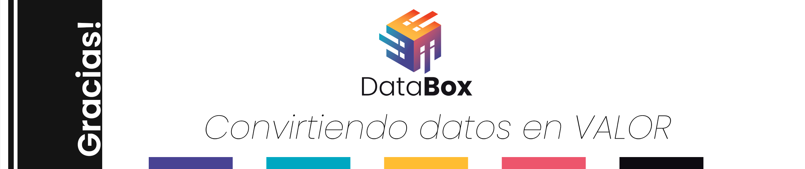

# Proyecto Grupal Final - Soy Henry ->Data Science

# Descripción General del Proyecto

1. [Sobre Nosotros](#sobre-nosotros)
2. [Nuestro cliente](#nuestro-cliente)
3. [El Mercado](#el-mercado)
4. [El Contexto Ambiental Actual](#el-contexto-ambiental-actual)
5. [Nuestra propuesta](#nuestra-propuesta)
6. [Objetivos Individuales](#objetivos-individuales)
7. [KPIs](#kpis)
8. [Tecnologías](#tecnologías)
9. [Metodología de trabajo](#metodología-de-trabajo)
10. [Diagrama de trabajo](#diagrama-de-trabajo)
11. [Producto principal](#producto)
12. [Participantes](#participantes)

# Sobre nosotros

Somos `DataBox` y nuestro compromiso es “Convertir datos en valor". En un mundo impulsado por la información, entendemos que los datos son más que números; son oportunidades. Fundada con la misión de transformar la forma en que las empresas utilizan su información, DATABOX se posiciona como un líder en soluciones de análisis de datos y business intelligence.
Nuestra visión es empoderar a las organizaciones a tomar decisiones informadas, basadas en insights profundos y estrategias adaptadas a sus necesidades. Con un equipo de expertos apasionados por la tecnología y la analítica, ofrecemos herramientas innovadoras que permiten a nuestros clientes extraer el máximo valor de sus datos.

# Nuestro cliente

BusTravel: Una empresa de `servicios de transporte de pasajeros`, que se encuentra operando en el sector de micros de media y larga distancia. Actualmente interesada en invertir en el sector de transporte de pasajeros con automóviles, con una visión de un futuro menos contaminado y ajustándose a las tendencias de mercado actuales.

# El Mercado

El mercado de `taxis en Nueva York` es un componente emblemático y crucial del sistema de transporte de la ciudad. El mismo ha sido históricamente regulado por la ciudad. La Comisión de Taxis y Limusinas (TLC) de Nueva York es el organismo encargado de supervisar las operaciones, otorgar licencias y establecer tarifas.
Existen diferentes tipos de “vehículos”:
   - `Taxis Amarillos`: Son los taxis más reconocibles de Nueva York y están autorizados para recoger pasajeros en la calle. Estos vehículos tienen un medallón que indica su licencia.

   - `Taxis Verdes (Boro Taxis)`: Introducidos para atender áreas de la ciudad que no son servidas por taxis amarillos, estos pueden recoger pasajeros en áreas de los cinco boroughs, excepto Manhattan.

   - `For-Hire Vehicles (FHVs)`: Los vehículos de alquiler (For-Hire Vehicles, FHVs) son una parte integral del sistema de transporte de Nueva York. Son vehículos que están afiliados a bases de vehículos de alquiler y que ofrecen servicios de transporte a través de despachos preorganizados en toda la ciudad de Nueva York. Estos vehículos no pueden ser detenidos en la calle como los taxis amarillos, y su uso generalmente implica la reserva previa a través de aplicaciones o servicios telefónicos.

   - `FHV - High Volume`:Los FHVs de alto volumen son aquellos vehículos que están afiliados a bases de alquiler que despachan al menos 10000 viajes por día. Actualmente, Lyft y Uber son las únicas bases que están autorizadas y clasificadas como FHV - High Volume.

# El Contexto Ambiental Actual

La situación ambiental en Nueva York y la calidad del aire son temas de gran relevancia, dados los desafíos urbanos asociados con la densidad de población, el tráfico vehicular, y la actividad industrial. 
La calidad del aire en NYC es monitoreada de manera constante por la Agencia de Protección Ambiental (EPA). A pesar de los esfuerzos para mejorar la calidad del aire, ciertos contaminantes siguen siendo preocupantes:
   - `Contaminantes con efectos a CORTO PLAZO` (tienen efectos rápidos y directos sobre la salud):
      - Material Particulado (PM10 y PM2.5): Estas partículas pueden penetrar en los pulmones y causar problemas respiratorios. Su origen puede incluir el tráfico vehicular, la construcción y otras actividades industriales.
      - Óxidos de Nitrógeno (NOx): Estos gases provienen principalmente de vehículos de motor y pueden contribuir a la formación de ozono a nivel del suelo.
      - Ozono Troposférico (O3): Se forma a partir de reacciones químicas entre los óxidos de nitrógeno y compuestos orgánicos volátiles (COV) en presencia de luz solar, lo que es un problema especialmente en los meses de verano.
      - Monóxido de carbono (CO):  Gas incoloro, inodoro y tóxico que se produce por la combustión incompleta de combustibles fósiles.Es un subproducto común de la combustión en motores de vehículos, especialmente en aquellos que funcionan con gasolina. 
   - `Contaminantes con efectos a LARGO PLAZO` (son gases de efecto invernadero e impacto lento):
      - Dióxido de Carbono (CO₂): Proviene principalmente de la quema de combustibles fósiles (carbón, petróleo y gas natural), tráfico y procesos industriales.Es el GEI más abundante y de mayor impacto en términos de volumen en la atmósfera.
      - Metano (CH₄): Es mucho más potente que el CO₂ para retener calor, aunque se encuentra en menores cantidades.Se emite principalmente en la agricultura.
      - Óxido Nitroso (N₂O): Sus emisiones provienen principalmente del uso de fertilizantes en la agricultura, así como de ciertos procesos industriales y la quema de combustibles.
 
Existen diferentes acciones que el gobierno ha implementado, mediante una gran variedad de `programas e iniciativas` para mejorar el sistema de taxis, fomentando la sostenibilidad y garantizando la protección de los consumidores. A medida que la ciudad avanza hacia un futuro más ecológico y equitativo, las políticas de la TLC seguirán desempeñando un papel crucial en la transformación del transporte urbano en Nueva York.
La Iniciativa Charge Up es un programa lanzado TLC con el objetivo de promover la adopción de vehículos eléctricos (EV) en el sector de taxis y vehículos de alquiler en la ciudad. Esta iniciativa es parte del compromiso de Nueva York para reducir las emisiones de gases de efecto invernadero y mejorar la calidad del aire. El mismo tiene como principales objetivos:
   - Fomentar la Electrificación: La iniciativa busca aumentar la adopción de vehículos eléctricos en la flota de taxis y vehículos de alquiler, facilitando la transición hacia una movilidad más sostenible.
   - Reducir Emisiones: Alentar el uso de vehículos eléctricos ayuda a disminuir las emisiones de carbono y otros contaminantes en la ciudad, contribuyendo a los objetivos de sostenibilidad de Nueva York.

# Nuestra propuesta

El objetivo principal de nuestro proyecto es poder analizar el mercado de taxis en la Ciudad Nueva York, corroborar la viabilidad de ingreso a dicho mercado, y en caso de resultar factible, identificar la mejor manera de hacerlo de una forma sustentable y ecológica mediante la incorporación de autos eléctricos.

# Objetivos individuales

- Analizar la situación actual del Mercado de Taxis en la ciudad de Nueva York, y su proyección para los próximos años (viajes, tarifas, millas totales).
- Analizar el contexto ambiental actual, analizar su tendencia en los últimos años.
- Conocer el impacto ambiental causado por los viajes de forma histórica y proyectada.
- Calcular el impacto de reemplazar autos convencionales por EV.
- Analizar la viabilidad financiera de la implementación de una flota de autos (EV o FV) en el mercado, calculando el ROI para diferentes alternativas
- Conocer cuáles son las mejores alternativas de vehículos desde el punto de vista financiero y ecológico.

# KPIs

## 1) Proporción total de ahorro de CO2 por mes:
Esta proporción se calcula comparando la cantidad de carbono emitido por milla en el mes usando el mix de vehículos REAL (incluyendo convencionales y eléctricos) con la cantidad de carbono que se emitiría si toda la flota fuera de vehículos convencionales.
### `Fórmula de Cálculo`
Proporción de ahorro total de carbono por mes = Cantidad de carbono emitido por milla por el mix de la flota REAL en el Mes /  Cantidad de carbono promedio por milla emitido si la flota fuera totalmente convencional en el mes
### `Parámetros`
- Carbono emitido por milla si la flota fuera totalmente convencional: Este valor se calcula utilizando la emisión promedio de carbono (gCO₂ por milla) de una flota convencional, basada en datos de la Agencia de Protección Ambiental (EPA).
- Carbono emitido por milla en el mix de la flota REAL: Se calcula en función de la combinación de vehículos convencionales y eléctricos que el Cliente planea incorporar. Las emisiones para vehículos eléctricos consideran la intensidad promedio de carbono de la electricidad, estimada en aproximadamente 404 gCO₂/kWh según la EPA.
### `Objetivo del KPI`
El objetivo es lograr una reducción del 30% en las emisiones de carbono en comparación con una flota totalmente convencional.

## 2) Participación mensual en el Mercado en cantidad de vehículos:
Este KPI mide la participación de la empresa en el mercado, en un período mensual, en función de la cantidad de autos que posee la empresa en circulación, en un periodo específico, en relación con el total de vehículos en circulación de todas las empresas del mercado.
### `Fórmula de Cálculo`
Participación mensual en el mercado en función a la cantidad de vehículos (%) = (Cantidad mensual de vehículos de la flota de la empresa)/Cantidad mensual de vehículos en circulación  ∗ 100
### `Parámetros`
- Cantidad mensual de vehículos de la empresa: Total de vehículos operativos de la empresa durante el mes de referencia.
- Total de vehículos en el mercado global: Total de vehículos operativos en el mercado general, incluyendo todos los competidores, durante el mismo mes.
### `Objetivo del KPI`
La meta de la empresa es alcanzar una participación de mercado del 1% mensual en términos de flota operativa en el mercado global de vehículos. Este KPI permitirá evaluar el progreso mensual en la competitividad, midiendo de forma continua cómo contribuyen las diferentes estrategias de crecimiento y expansión.

## 3) Participación mensual en el Mercado en cantidad de viajes:
Este KPI mide la participación de la empresa en el mercado en función de la **cantidad de viajes realizados** en un mes dado, en relación con el **total de viajes en el mercado global** en el mismo mes.
### `Fórmula de Cálculo`
Participación mensual en el mercado (%) = (Cantidad de viajes realizados por la empresa en un mes / Total de viajes en el mercado global en un mes) * 100
### `Parámetros`
- Cantidad de viajes realizados por la empresa**: Total de viajes realizados por la empresa durante el mes de análisis.
- Total de viajes en el mercado global**: Total de viajes realizados en el mercado general, incluyendo todos los competidores, durante el mismo mes.
### `Objetivo del KPI`
Se quiere lograr una participación del 1% en la cantidad de viajes realizados mensualmente en el mercado global de transporte. Este KPI permitirá medir la competitividad de la empresa en términos de actividad operativa, evaluando de forma continua el impacto de nuestras estrategias de crecimiento en el volumen de viajes realizados y en nuestra expansión dentro del mercado.

## 4) Retorno sobre la Inversión (ROI): 
Este KPI mide la rentabilidad de las inversiones realizadas por la empresa por mes, reflejando el retorno financiero generado en relación con la inversión total mensual. 
Se utiliza para evaluar la eficiencia de las inversiones en función de las ganancias obtenidas.
### `Fórmula de Cálculo` 
Retorno sobre la Inversión (ROI) (%) = (Ganancias mensuales obtenidas – Inversión mensual total) / Inversión mensual total ∗ 100 
### `Parámetros`
- Ganancias obtenidas: Total de ingresos o beneficios generados a partir de la inversión durante el mes de análisis. 
- Inversión total: Monto total invertido en el proyecto durante el mismo mes. 
### `Objetivo del KPI` 
Este KPI permite a la empresa evaluar la efectividad de sus inversiones, estableciendo una meta de superar el 8% de rentabilidad mensual. Con este indicador, la empresa puede identificar áreas de oportunidad para maximizar el retorno, optimizar la asignación de recursos y asegurar que las estrategias de inversión estén alineadas con el crecimiento financiero y la sostenibilidad de la organización.

# Tecnologías

# Metodología de trabajo

Para la gestión y desarrollo de este proyecto, hemos adoptado la metodología ágil `SCRUM`, que nos permite un enfoque iterativo e incremental, ideal para lograr flexibilidad y una rápida adaptación a cambios. SCRUM estructura el trabajo en ciclos cortos de desarrollo y entrega, conocidos como sprints. En este caso se estructurará en 3 sprints en total.
Consideramos las siguientes ventajas que nos ofrece este método:

- Flexibilidad y Adaptabilidad: Nos permite adaptarnos rápidamente a los cambios en los requisitos.
- Mejora Continua: Las retrospectivas de cada sprint nos ayudan a optimizar los procesos.
- Enfoque en el Valor del Negocio: El Product Owner asegura que el equipo se enfoque en las tareas que aportan más valor al cliente o usuario final.
- Colaboración y Transparencia: La comunicación constante y las revisiones periódicas mantienen la transparencia y alineación del equipo.

# Diagrama de Trabajo
Optamos por realizar un `Diagrama de Gantt`.
Mediante esta representación visual mostramos  un cronograma de proyecto que muestra las actividades a lo largo del tiempo. Cada actividad o tarea se representó como una barra horizontal cuyo tamaño indica la duración de la tarea. Las tareas se organizan a lo largo de un eje temporal.
El mismo nos permite:
   - Visualización Temporal: Nos permite ver el inicio y la duración de cada tarea, así como las dependencias entre ellas.
   - Planificación Detallada: Definimos las tareas de forma secuencial, donde las dependencias son importantes.
   - Monitoreo del Progreso: Nos permite ir conociendo el estado actual del proyecto, mostrando las tareas completadas y las que están en progreso.

# Producto
Una vez concluido el analisis detallado previamente procederemos a entregar a nuestro cliente un `MVP` que contiene:
- Informe final sobre los objetivos planteados y con sus respectivas conclusiones. 
- Dashboard interactivo y dinámico que le permita explorar de manera gráfica los insight obtenidos.
- Diversos modelos de Machine Learning para proyectar patrones con vistas al futuro. 
- Aplicacion web interactiva donde alojaremos el dashboard y los modelos que respaldan nuestro análisis.

# Participantes

## *Hernán Lussiatti*

## *María Lara Rossetti*

## *Cristian Andrés Riveros Cubillos*

## *Maillen Fiorio Espinasse*

## *María Florencia Zapata*

## *Andrew Garcia Gomez*

#

