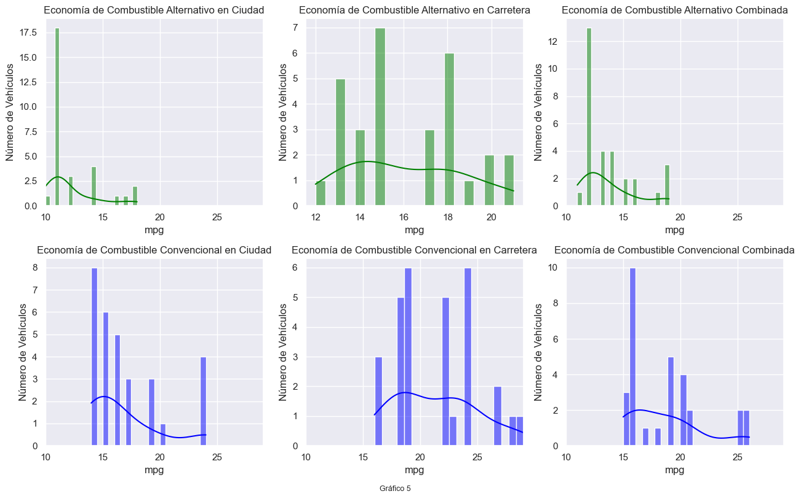

# Análisis Exploratorio de Datos (EDA) de vehículos que utilizan energás alternativas y autos eléctricos

## Descripción del Proyecto

Este proyecto se centra en el análisis exploratorio de datos de un conjunto de datos relacionado con vehículos de combustible alternativo y coches eléctricos. El objetivo es entender mejor las características y tendencias de estos vehículos, incluyendo el año del modelo, la eficiencia, relación precio autonomía y modelos disponibles.

## Contenido del Proyecto

**Datasets originales:** Los datos se obtienen del siguiente enlace: https://drive.google.com/drive/folders/15GG63G6oZODqYjIcphwqQmJbXRvPi-jC?usp=sharing
**`EDA_alternativecars.ipynb`:** EDA detallado del proyecto.

## Análisis Realizado

En este primer EDA, realicé un análisis de los datos en crudo de la base de datos, para conocer la calidad de los mismos, la presencia de outliers, datos nulos, etc. Luego de este trabajo vendrá una etapa de ETL más detallada para así poder enfocar los datos a nuestro trabajo de interés.

## Introducción

### Contexto del Problema

Analizamos en este apartado los datasets sobre autos que usan alternativas a la nafta y otro específico de autos eléctricos. Esto nos ayudará a tener un entendimiento más profundo de este tipo de vehiculos que son los que la empresa cree conveniente utilizar en reemplazo de los tradicionales, tanto por motivos ecológicos como así por las propuestas e incentivos que se están e irán dando en esta dirección en Nueva York.

### Metodología

Para alcanzar estos objetivos, realicé las siguientes etapas de este primer análisis de EDA:

1. **Tipos de datos:** Identificaremos los tipos de datos de cada columna (numérico, categórico, fecha, etc), para luego acomodar aquellos que correspondan.

2. **Nulos:** Detectaremos los valores de celdas que están sin nigún tipo de datos y evaluamos que acción tomar con ellos.

3. **Valores faltantes:** Similar al paso anterior, se refiere a la identificación de celdas que sí contienen datos pero los mismos son nan o no condicen con el el tipo de dato esperado.

4. **Duplicados:** Identificaremos y eliminaremos filas duplicadas en el dataset.

5. **Diccionario de datos:** Crearemos un diccionario de datos que describa cada columna del dataset.

6. **Outliers:** Detectaremos valores atípicos que pueden distorsionar el análisis.

7. **Distribución:** Analizaremos la distribución de los datos para entender su comportamiento.

8. **Visualización de Datos**
   - Gráficos de dispersión para analizar la relación entre eficiencia y rango.
   - Histogramas para la distribución de la aceleración.
   - Gráficos de caja para identificar valores atípicos en el año del modelo.

## Herramientas Utilizadas

- Python
- Pandas
- Matplotlib
- Seaborn
- Jupyter Notebook

## Alternative Fuel Vehicles

**Diccionario de datos:**

1. Dataset: Alternative Fuel Vehicles

| Columna                            | Descripción                                                             | Tipo de Dato |
| ---------------------------------- | ----------------------------------------------------------------------- | ------------ |
| Category                           | Categoría del vehículo (e.g., BEV, PHEV, etc.)                          | object       |
| Model                              | Modelo del vehículo                                                     | object       |
| Model Year                         | Año del modelo del vehículo                                             | float64      |
| Manufacturer                       | Fabricante del vehículo                                                 | object       |
| Fuel                               | Tipo de combustible (e.g., Gasolina, Eléctrico, etc.)                   | object       |
| All-Electric Range                 | Autonomía total en modo totalmente eléctrico (millas)                   | float64      |
| PHEV Total Range                   | Autonomía total de vehículos híbridos enchufables (millas)              | float64      |
| Alternative Fuel Economy City      | Economía de combustible en ciudad con combustible alternativo (mpg)     | float64      |
| Alternative Fuel Economy Highway   | Economía de combustible en carretera con combustible alternativo (mpg)  | float64      |
| Alternative Fuel Economy Combined  | Economía de combustible combinada con combustible alternativo (mpg)     | float64      |
| Conventional Fuel Economy City     | Economía de combustible en ciudad con combustible convencional (mpg)    | float64      |
| Conventional Fuel Economy Highway  | Economía de combustible en carretera con combustible convencional (mpg) | float64      |
| Conventional Fuel Economy Combined | Economía de combustible combinada con combustible convencional (mpg)    | float64      |
| Transmission Type                  | Tipo de transmisión (e.g., Automática, Manual)                          | object       |
| Transmission Make                  | Fabricante de la transmisión                                            | object       |
| Engine Type                        | Tipo de motor (e.g., V6, Eléctrico)                                     | object       |
| Engine Size                        | Tamaño del motor (litros)                                               | object       |
| Engine Cylinder Count              | Número de cilindros del motor                                           | float64      |
| Number of Passengers               | Número de pasajeros que puede transportar el vehículo                   | object       |
| Heavy-Duty Power System            | Sistema de potencia para vehículos pesados                              | object       |
| Notes                              | Notas adicionales sobre el vehículo                                     | object       |
| Drivetrain                         | Tipo de tracción (e.g., Tracción delantera, Tracción total)             | object       |

Luego de trabajar en el dataset siguiendo la metodología arriba listada y detalla en el EDA, se concluye que:

- La calidad de los datos de este dataset no es tan bueno, dado que si bien hay solo una fila duplicada, hay numerosos valores nulos y faltantes. A su vez notamos que hay columnas que quizás no son necesarias para el trabajo que estamos realizando. Por ello definitivamente realizar un ETL para luego generar un segundo EDA de los datos podría ser una gran respuesta.

- Ya en cuanto a los datos en sí podemos concluir que:

1. Los vehículos de los que más modelos se tiene de acuerdo a la carrocería son los SEDAN/WAGON y SUV, que son en general autos espaciosos pero a su vez no tan grandes. Probablemente de ellos haya más diseños dado que mucha población busca este tipo de vehiculos ya sea por su practicidad, moda, tamaño, etc.
2. Luego en cuanto a los años de los vehiculos hay registros de 2021 y 2022, lo que habla de lo actual de los datos y a su vez se nota un crecimiento de un año a otro. Quizas necesitaríamos una proyección de más años para poder concluir si se trata de una tendencia que irá en aumento o no.
3. En cuanto al top 10 de fabricantes de vehiculos notamos tanto marcas caracterizadas por fabricar vehiculos de lujo como así también algunas que son de acceso masivo. El número 1 de hecho es un fabricante de autos que usa todo tipo de publico americano, Ford. Y la presencia de varias marcas de lujo quizás tenga que ver con que son tipos de vehiculos cuya fabricación está siendo vanguardia y tratan de no quedar fuera de ese concepto de autos exclusivos.
4. Respecto de la distribución de acuerdo al tipo de energía utlizada, se nota una claro liderazgo de los autos eléctricos, en primero lugar electricos híbridos pero le siguen los eléctricos puros y los enchufables. Luego le siguen energias alternativas renobables como: biodisel, etanol e hidrógeno. Y ya en menor medida aparecen múltiples variantes de combustibles no renovables como energía, principalmente alrededor del gas natural (GNC).
5. Graficamos y analizamos una comparación entre los vehículos que usan energía convencional vs los alternativos en carreteras, en ciudades y combinadas usando como medida de comparación, la economía de combustible. La conclusión en este caso fue que en los 3 escenarios es más eficaz el auto eléctrico aunque en lo que se refiere a ciudad la diferencia es muy leve.

**Economía de Combustible:** Mide la eficiencia con la que un vehículo utiliza el combustible para recorrer una distancia. Se expresa en millas por galón (mpg) o litros por cada 100 kilómetros (L/100 km). Ej: Un auto con una economía de combustible de 30 mpg puede recorrer 30 millas con un galón de gasolina.

## Electric Cars

**Diccionario de datos:**

2. Dataset: Electric Cars:

| Columna         | Descripción                                                            | Tipo de Dato |
| --------------- | ---------------------------------------------------------------------- | ------------ |
| Brand           | Marca del coche                                                        | object       |
| Model           | Modelo del coche                                                       | object       |
| AccelSec        | Aceleración de 0 a 100 km/h en segundos                                | float64      |
| TopSpeed_KmH    | Velocidad máxima en kilómetros por hora                                | int64        |
| Range_Km        | Autonomía en kilómetros                                                | int64        |
| Efficiency_WhKm | Eficiencia energética en vatios-hora por kilómetro                     | int64        |
| FastCharge_KmH  | Kilómetros de autonomía ganados por hora de carga rápida               | int64        |
| RapidCharge     | Indica si el coche soporta carga rápida (Yes o No)                     | object       |
| PowerTrain      | Tipo de tren motriz (e.g., AWD, RWD, FWD)                              | object       |
| PlugType        | Tipo de enchufe para la carga (e.g., Type2, CCS)                       | object       |
| BodyStyle       | Estilo de carrocería (e.g., SUV, Sedan)                                | object       |
| Segment         | Segmento del mercado al que pertenece el coche (e.g., Compact, Luxury) | object       |
| Seats           | Número de asientos                                                     | int64        |
| PriceEuro       | Precio del coche en euros                                              | int64        |

Luego de trabajar en el dataset siguiendo la metodología arriba listada y detalla en el EDA, se concluye que:

- La calidad de los datos de este dataset es muy bueno. No hay filas duplicadas, ni datos nulos y en a excepción de un solo dato, FastCharge_KmH, el resto tenían el tipo de dato adecuado para su análisis. Notamos igual que quizás también hay columnas que no son necesarias para el trabajo que estamos realizando. Por ello también realizaremos un ETL para luego generar un segundo EDA de los datos podría ser una gran respuesta.

- En cuanto a outliers encontramos un par, pero llegamos a la coclusión que probablemente se deba a causas de ser datos atípicos respecto de los otros pero correctos. Como por ejemplo en el boxplot de precio notamos que hay unos pocos datos muy por encima del precio de los otros, pero eso se debe a que hay entre los modelos del dataset autos de muy alta gama que lógicamente tendrán un precio muy diferente.

- Ya en cuanto a los datos en sí podemos concluir que:

1. En cuanto al top 10 de marcas fabricantes de vehiculos existe un claro líder que es Tesla mientras que Ford ya aprece en el último puesto de esta lista pero hay más presencia de marcas más populares que en el otro dataset.
2. Respecto a la cantidad de modelos de autos fabricados de acuerdo a la cantidad de asientos, notamos que la mayoría de modelos de autos eléctricos diseñados es de 5 personas, probablemente asociado a una familia tipo, lo cual sería interesante analizar si es el modo más frecuente de viajar o no.
3. En el caso del análisis del promedio del precio de un vehiculo de cada marca, vimos como ese promedio varia desde aquellas marcas de lujo con un precio promedio por arriba de los 100.000 euros a marcas con modelos con precios en promedio más acequibles, rondando la mayoría valores entre 20.000 y 40.000 euros en promedio.
4. En sintonía con lo analizado en el dataset de autos de energías alternativas, vemos que los vehículos de los que más modelos se fabrica de acuerdo a la carrocería son los SUV y Hatchback, a la cabeza y ya más relegado vienen los SEDAN.
5. Relación entre Eficiencia Energética y Autonomía: Existe una relativa tendencia negativa, donde los vehículos con menor eficiencia energética (mayor consumo de Wh/Km), tienden a tener menor autonomía. Esto sugiere que los vehículos que consumen más energía por kilómetro tienen una autonomía más limitada en terminos generales, lo cual es el dato esperado de manera intuitiva.

**Autonomía:** Mide la distancia total que un vehículo puede recorrer con una carga completa de combustible o batería. Se expresa en millas o kilómetros. Ej: Un coche con una autonomía de 300 millas puede viajar 300 millas antes de necesitar recarga.

6. Por último, al relacionar autos de diferente tipo de carrocería midiendo su autonomía en relación con el precio, podemos ovservar que, tal como se esperaría, existe una tendencia positiva, donde a mayor autonomía del vehículo mayor su precio. Probablemente tenga que ver no solo con la eficiencia de la bateria sino también con su capacidad, lo cual explica el mayor costo. Tambien se ovbserva que, la mayoría de los vehículos se agrupan en el rango de precios entre 10.000 y 100.000 EUR, con autonomías que varían ampliamente dentro de este rango de precios y con una clara presencia de autos tipo Hatchback y SUV. También vemos como particularidad que el auto de mayor costo y autonomía se trata de un auto convertible, posiblemente un deportivo.

